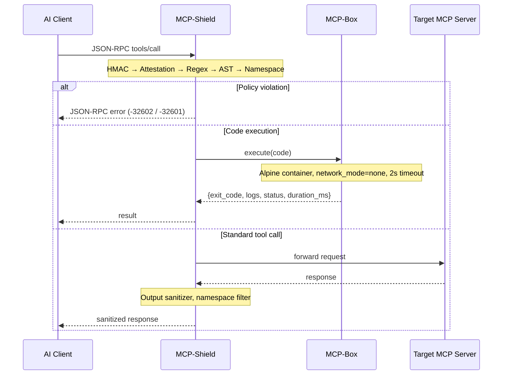

# MCP-Secure-Suite

A dual-layer security proxy for the Model Context Protocol (MCP). Built as an open-source implementation of the mitigations proposed in [Breaking the Protocol](https://arxiv.org/abs/2601.17549) (Maloyan & Namiot, arXiv:2601.17549, Jan 2026).

MCP has three documented protocol-level vulnerabilities — capability escalation, unauthenticated sampling, and implicit cross-server trust propagation. This suite blocks all three, plus code injection and indirect prompt injection, at the protocol boundary before anything reaches the host system.

---

## How it works

Two components, both required:

**MCP-Shield** sits between the AI client (Cursor, Claude Code, any MCP host) and the target MCP server. Every JSON-RPC frame passes through it. It validates capability certificates, checks HMAC signatures, scans code payloads with an AST walker, enforces tool namespace locks, and sanitizes server outputs before they reach the LLM context.

**MCP-Box** handles code execution. When Shield clears an `execute_code` call, it dispatches the payload to Box rather than running it directly. Box spins up a one-shot Alpine container with no network access, a 128MB memory cap, and a 2-second watchdog. The container is force-removed after every execution regardless of outcome.



---

## Quick start

Requires Python 3.11+ and Docker (required for end-to-end tests and the live demo).

```bash
make install              # install dependencies into .venv
make build-sandbox-image  # build the Alpine sandbox image (mcp-box-sandbox:latest)
make test                 # run the full test suite
```

To run the full stack with mock servers:

```bash
docker-compose up -d   # start gateway + trusted + adversarial mock servers
./demo.sh              # fire three attack payloads and show results
docker-compose down    # tear down when finished
```

The admin dashboard is at `http://localhost:8000/dashboard/` once the stack is running.

---

## Security layers

### Layer 1 — MCP-Shield

| Check | What it does |
|---|---|
| HMAC-SHA256 | Validates request signatures per server using pre-shared keys. Blocks replayed requests via a 30-second nonce window. |
| Capability attestation | Verifies X.509 certificates presented during `initialize`. Blocks any method call not covered by the server's attested capabilities. |
| Regex scan | Checks all tool arguments against a configurable blacklist (`rm -rf`, `/etc/passwd`, `nc -e`, `curl \| bash`, etc.). |
| AST scan | Parses code arguments into an AST and walks the tree. Blocks restricted imports (`os`, `subprocess`, `socket`), dangerous calls (`eval`, `exec`, `getattr`), and restricted attribute access. Catches obfuscation that regex cannot. |
| Namespace lock | Intercepts `tools/list` responses and strips any tool not in the server's allowed list in `shield_config.json`. Prevents shadow tool registration. |
| Output sanitizer | Scans tool outputs line-by-line and as full text. Replaces prompt injection patterns (`Ignore previous instructions`, `System:`, etc.) before they reach the LLM context. |

### Layer 2 — MCP-Box

Every code execution runs in a fresh container:

- `network_mode: none` — no outbound connections possible
- `mem_limit: 128m` — OOM kill on excess allocation
- `read_only: true` — root filesystem is immutable
- `user: sandboxuser` — non-root, uid 1000
- 2-second `asyncio.wait_for` watchdog — infinite loops are killed
- `container.remove(force=True)` in `finally` — cleanup runs regardless of outcome
- Label-based orphan pruning on startup — no leftover containers from previous crashes

Pre-installed in the sandbox image: `numpy`, `pandas`, `matplotlib`, `python-dateutil`, `pytz`. No internet access so no runtime pip installs.

---

## Test results

78 tests, 12 modules, 5.75 seconds.

```
tests/test_schemas.py              17 passed   Pydantic models, JSON-RPC validation
tests/test_database.py              3 passed   WAL logger, concurrent writes, unavailable DB
tests/test_certs.py                 8 passed   CA fixture, cert verification, expiry, tampering
tests/test_box_isolated.py          6 passed   Clean exec, timeout, network isolation, OOM, cleanup, read-only FS
tests/test_policy_regex.py          8 passed   Blacklist patterns, clean input pass-through
tests/test_policy_ast.py            7 passed   Import blocks, call blocks, attribute blocks, obfuscation
tests/test_namespace_sanitizer.py   7 passed   Namespace lock, output sanitizer, case-insensitive matching
tests/test_hmac.py                  4 passed   Valid HMAC, bad signature, replay, expired timestamp
tests/test_attestation.py           4 passed   Valid cert, expired cert, wrong server ID, capability check
tests/test_engine.py                3 passed   Stage ordering, clean pass, integration
tests/test_end_to_end.py            5 passed   E1–E5 against live gateway and adversarial mock server
tests/test_stdio_proxy.py           3 passed   Pass-through, block, output sanitization
```

### Attack success rate (E5 benchmark)

`test_e5_attack_success_rate_comparison` sends the same payload directly to the adversarial server (port 8002, no protection) and through Shield (port 8000), and compares results.

| Attack type | Without Shield | Through Shield | Mitigation triggered |
|---|---|---|---|
| Command injection (`import os; os.system(...)`) | 100% | 0% | AST scan — stage: ast |
| Indirect prompt injection (`Ignore previous instructions`) | 100% | 0% | Output sanitizer |
| Unauthorized sampling escalation | 100% | 0% | Capability attestation |
| Infinite loop / resource exhaustion | 100% | 0% | Box watchdog + OOM cap |

Consistent with the ATTESTMCP effectiveness predictions in the primary reference (arXiv:2601.17549).

---

## Configuration

All security policy is declarative in `config/shield_config.json`. No code changes needed to add patterns, extend tool namespaces, or adjust trust mode.

```json
{
  "trust_mode": "prompt",
  "servers": {
    "filesystem-server": {
      "allowed_tools": ["read_file", "write_file", "list_directory"],
      "sampling_allowed": false
    }
  },
  "ast_policy": {
    "blocked_modules": ["os", "sys", "subprocess", "socket", "ctypes"],
    "blocked_calls": ["eval", "exec", "getattr", "__import__"]
  }
}
```

HMAC keys are loaded from environment variables (`MCP_KEY_FILESYSTEM`, `MCP_KEY_TRUSTED`) — never stored in the config file.

---

## Stdio mode

Shield can run as a stdio proxy wrapping any MCP server subprocess:

```bash
python -m mcp_shield.src.stdio_proxy -- npx -y @modelcontextprotocol/server-filesystem /home/user
```

Everything after `--` is the server command. The proxy intercepts both directions: client requests are validated before forwarding, server responses are sanitized before returning. JSON-RPC error frames are written to stdout on block so the AI client never hangs.

---

## Limitations

- **Container escape via kernel exploit** — Box uses OS-level namespaces, not hardware virtualisation (Firecracker/gVisor). A kernel vulnerability could allow host escape. Acceptable for local development; production deployments should use a VM-backed executor.
- **Persistent injection (sleeper channels)** — attacks that plant artifacts in long-term memory or filesystem cron paths and trigger later are out of scope. See Maloyan & Namiot, arXiv:2605.13471 for this threat model.
- **First-contact TOFU attacks** — on first connection from a server that has never presented ATTESTMCP credentials, the suite operates in permissive mode. Key pinning is not yet implemented.
- **Legitimately certified malicious servers** — attestation proves identity, not behaviour. A server with a valid certificate serving malicious content passes the attestation check.
- **Transport-layer attacks** (MiTM, DNS rebinding) — require TLS termination and certificate pinning at the transport layer, which is outside the current scope.

---

## References

Maloyan, N. & Namiot, D. (2026). *Breaking the Protocol: Security Analysis of the Model Context Protocol Specification and Prompt Injection Vulnerabilities in Tool-Integrated LLM Agents*. arXiv:2601.17549v1 [cs.CR].

Maloyan, N. & Namiot, D. (2026). *Prompt Injection Attacks on Agentic Coding Assistants: A Systematic Analysis of Vulnerabilities in Skills, Tools, and Protocol Ecosystems*. arXiv:2601.17548 [cs.CR].

Maloyan, N. & Namiot, D. (2026). *Sleeper Channels and Provenance Gates: Persistent Prompt Injection in Always-on Autonomous AI Agents*. arXiv:2605.13471 [cs.CR].

Rostamzadeh, M. et al. (2026). *MCP-DPT: A Defense-Placement Taxonomy and Coverage Analysis for Model Context Protocol Security*. arXiv:2604.07551 [cs.CR].

Yang, Y. et al. (2025). *MCPSecBench: A Systematic Security Benchmark and Playground for Testing Model Context Protocols*. arXiv:2508.13220 [cs.CR].

--- 

MIT — see [LICENSE](LICENSE) for details.
