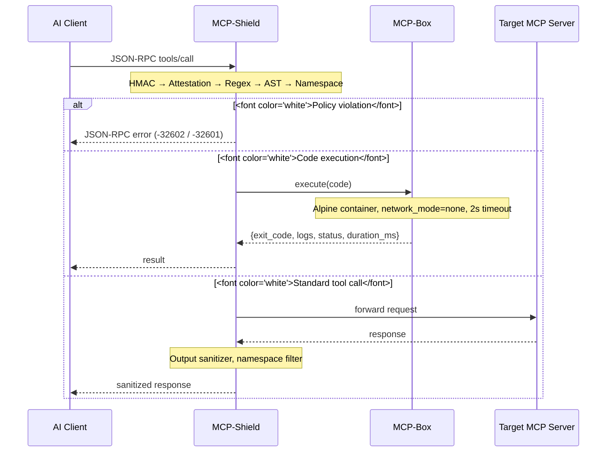

# Architecture

## How it works

Two components, both required:

**MCP-Shield** sits between the AI client (Cursor, Claude Code, any MCP host) and the target MCP server. Every JSON-RPC frame passes through it. It validates capability certificates, checks HMAC signatures, scans code payloads with an AST walker, enforces tool namespace locks, and sanitizes server outputs before they reach the LLM context.

**MCP-Box** handles code execution. When Shield clears an `execute_code` call, it dispatches the payload to Box rather than running it directly. Box spins up a one-shot Alpine container with no network access, a 128MB memory cap, and a 2-second watchdog. The container is force-removed after every execution regardless of outcome.



## Stdio mode

Shield can run as a stdio proxy wrapping any MCP server subprocess:

```bash
python -m mcp_shield.src.stdio_proxy -- npx -y @modelcontextprotocol/server-filesystem /home/user
```

Everything after `--` is the server command. The proxy intercepts both directions: client requests are validated before forwarding, server responses are sanitized before returning. JSON-RPC error frames are written to stdout on block so the AI client never hangs.
