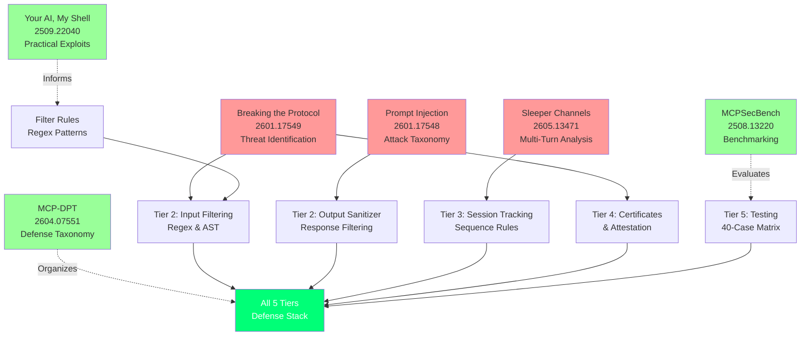

# References

This page lists all research papers that inform MCP Shield's design and testing methodology.

---

## Papers

| Paper | Authors | Year | arXiv | Field | Key Contribution |
|-------|---------|------|-------|-------|------------------|
| **Breaking the Protocol** | Maloyan & Namiot | 2026 | [2601.17549](https://arxiv.org/abs/2601.17549) | MCP Security | Identifies three core protocol-level vulnerabilities |
| **Prompt Injection Attacks** | Maloyan & Namiot | 2026 | [2601.17548](https://arxiv.org/abs/2601.17548) | Injection Attacks | Taxonomy of attack vectors at tool layer |
| **Sleeper Channels & Provenance Gates** | Maloyan & Namiot | 2026 | [2605.13471](https://arxiv.org/abs/2605.13471) | Persistence Attacks | Multi-turn state drift in long-running agents |
| **MCP-DPT** | Rostamzadeh et al. | 2026 | [2604.07551](https://arxiv.org/abs/2604.07551) | Defense Taxonomy | Five-tier defense placement framework |
| **MCPSecBench** | Yang et al. | 2025 | [2508.13220](https://arxiv.org/abs/2508.13220) | Benchmarking | Standardized attack scenarios & evaluation methods |
| **Your AI, My Shell** | Liu et al. | 2025 | [2509.22040](https://arxiv.org/abs/2509.22040) | Practical Exploits | Real-world attack demonstrations & obfuscation |

---

## How MCP Shield Implements These



---

## Key References by Use Case

**Understanding the threat model:**  
→ Read [Breaking the Protocol](https://arxiv.org/abs/2601.17549) (Maloyan & Namiot 2026)

**Understanding attack patterns:**  
→ Read [Prompt Injection Attacks](https://arxiv.org/abs/2601.17548) (Maloyan & Namiot 2026)

**Understanding multi-turn attacks:**  
→ Read [Sleeper Channels](https://arxiv.org/abs/2605.13471) (Maloyan & Namiot 2026)

**Understanding test organization:**  
→ Read [MCP-DPT](https://arxiv.org/abs/2604.07551) (Rostamzadeh et al. 2026)

**Understanding benchmarking approach:**  
→ Read [MCPSecBench](https://arxiv.org/abs/2508.13220) (Yang et al. 2025)

---

## Basic Citation

For academic work referencing MCP Shield:

```
Maloyan, N. & Namiot, D. (2026). Breaking the Protocol: Security Analysis 
of the Model Context Protocol Specification and Prompt Injection 
Vulnerabilities in Tool-Integrated LLM Agents. arXiv:2601.17549v1 [cs.CR].
```

For BibTeX entries and detailed citations, see [Full Reference List](#full-reference-list) below.

---

## Full Reference List

### Breaking the Protocol

Maloyan, N. & Namiot, D. (2026). *Breaking the Protocol: Security Analysis of the Model Context Protocol Specification and Prompt Injection Vulnerabilities in Tool-Integrated LLM Agents*. arXiv:2601.17549v1 [cs.CR].

**Relevance:** Foundation for the threat model. Identifies capability escalation, unauthenticated sampling, and cross-server trust propagation vulnerabilities that MCP Shield addresses.

**Implementation Basis:**
- Tier 4 (Certificate validation) → Section III.1: Capability escalation
- Tier 2 (Input filtering) → Section III.2: Injection attacks

---

### Prompt Injection Attacks on Agentic Coding Assistants

Maloyan, N. & Namiot, D. (2026). *Prompt Injection Attacks on Agentic Coding Assistants: A Systematic Analysis of Vulnerabilities in Skills, Tools, and Protocol Ecosystems*. arXiv:2601.17548 [cs.CR].

**Relevance:** Comprehensive taxonomy of response-based injections and cross-tool context attacks.

**Implementation Basis:**
- Tier 2 (Output sanitizer) → Section III: Response injection taxonomy

---

### Sleeper Channels and Provenance Gates

Maloyan, N. & Namiot, D. (2026). *Sleeper Channels and Provenance Gates: Persistent Prompt Injection in Always-on Autonomous AI Agents*. arXiv:2605.13471 [cs.CR].

**Relevance:** Analyzes persistence attacks and multi-call state drift, motivating session-layer defenses.

**Implementation Basis:**
- Tier 3 (Session tracking) → Section III: Cross-session injection chains

---

### MCP-DPT: A Defense-Placement Taxonomy

Rostamzadeh, M. et al. (2026). *MCP-DPT: A Defense-Placement Taxonomy and Coverage Analysis for Model Context Protocol Security*. arXiv:2604.07551 [cs.CR].

**Relevance:** Provides the five-tier defense taxonomy used throughout MCP Shield.

---

### MCPSecBench: A Systematic Security Benchmark

Yang, Y. et al. (2025). *MCPSecBench: A Systematic Security Benchmark and Playground for Testing Model Context Protocols*. arXiv:2508.13220 [cs.CR].

**Relevance:** Standardized benchmark framework for evaluating MCP security systems.

---

### "Your AI, My Shell": Demystifying Prompt Injection Attacks

Liu, Y. et al. (2025). "Your AI, My Shell": Demystifying Prompt Injection Attacks on Agentic AI Coding Editors. arXiv:2509.22040 [cs.CR].

**Relevance:** Practical attack demonstrations that inform regex filters and AST obfuscation detection.

---

## Contributing

Found a new relevant paper? Submit a GitHub issue with the paper title, arXiv ID, and how it relates to MCP security.

---

## Disclaimer

MCP Shield implements mitigations based on the threat models and attack scenarios identified in these papers. However:

- Some identified threats may not yet be actively exploited
- Defenses may be incomplete or imperfect
- New vulnerabilities may be discovered after publication

Always keep MCP Shield and dependencies updated.
